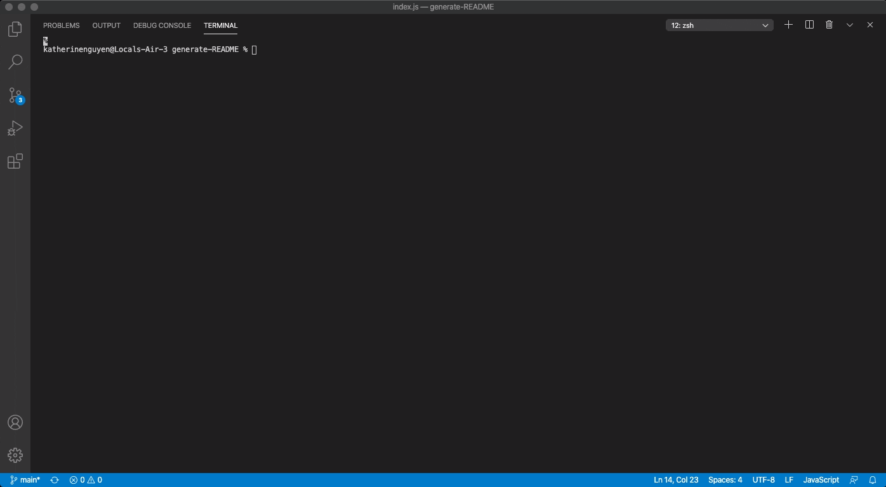

# README Generator

## Description 

   This command-line application dynamically generates a professional README.md file from a user’s input using the Inquirer package. The application will be invoked using the following command: node index.js. This application allows project creator to devote more time to working on the project. 

## Table of Contents (Optional)

If your README is very long, add a table of contents to make it easy for users to find what they need.

* [Installation](#installation)
* [Usage](#usage)
* [License](#license)
* [Questions](#questions)

## Installation

   npm i inquirer
   
   npm i axios

## Usage 

## License

   MIT

## Badges

   
## Contributing

No

## Tests

N/A

   ## Questions
   Github Profile: https://github.com/katnguyenn 
   Email: nguyenkat01@yahoo.com	

